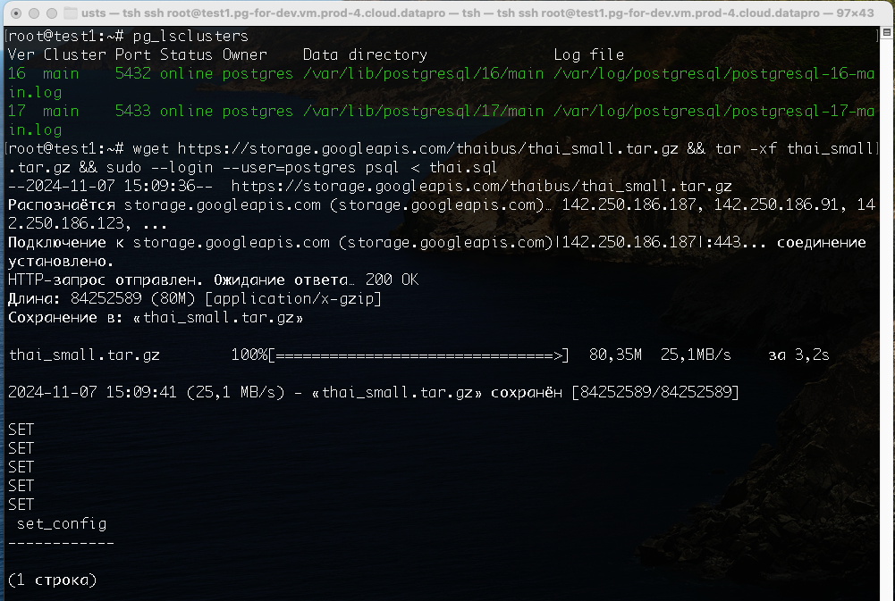
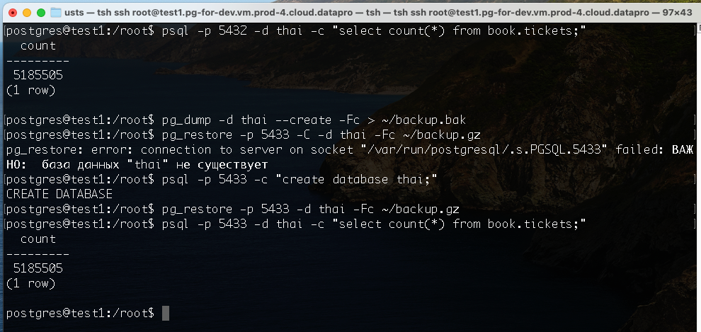
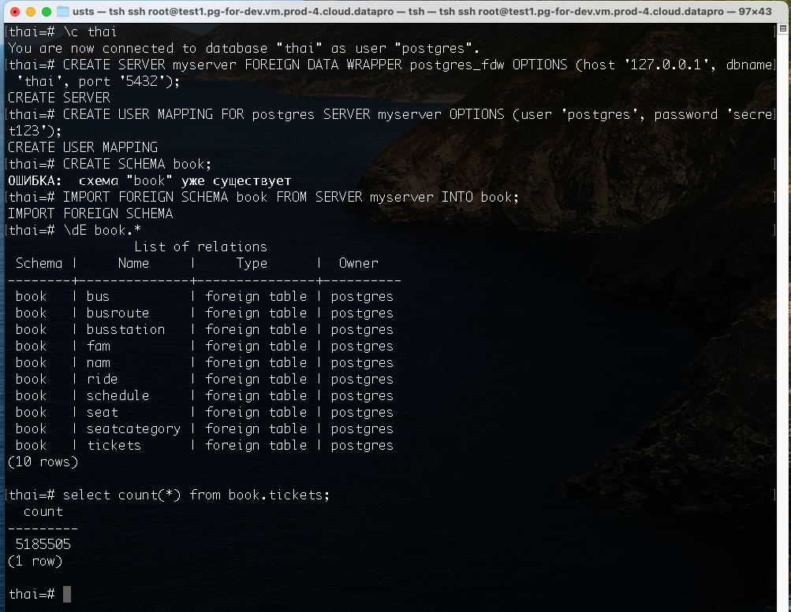
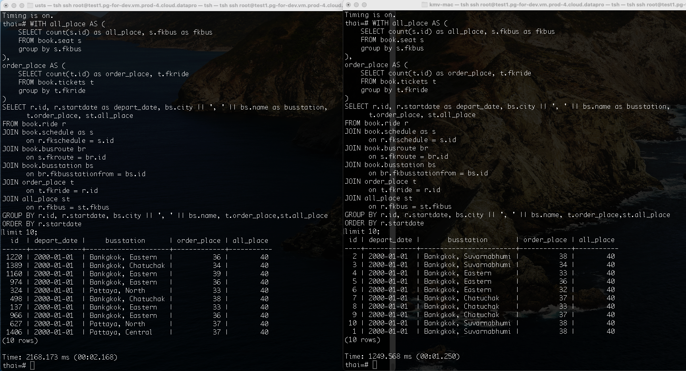

1,2,3) Установить 16 ПГ, Залить средние Тайские перевозки, Рядом поднять кластер 17 версии



4) Тестируем вариант миграции с помощью pg_dump/pg_restore

```
su postgres

psql -p 5432 -d thai -c "select count(*) from book.tickets;"
pg_dump -d thai --create -Fc > ~/backup.bak #15:29

psql -p 5433 -c "create database thai;"
pg_restore -p 5433 -d thai -Fc ~/backup.gz
psql -p 5433 -d thai -c "select count(*) from book.tickets;"
```



Как видим, мы мигрировали данные между разными версиями ПГ, на учебной VM это заняло ~9min на small thai базе

5) Тестируем вариант миграции с помощью postgres_fdw

```
-- пользователь для fwd
psql -p 5432 -c "ALTER USER postgres WITH PASSWORD 'secret123';"

psql -p 5433

create database thai;
\c thai

create extension postgres_fdw;

postgres=# CREATE SERVER myserver FOREIGN DATA WRAPPER postgres_fdw OPTIONS (host '127.0.0.1', dbname 'thai', port '5432');
postgres=# CREATE USER MAPPING FOR postgres SERVER myserver OPTIONS (user 'postgres', password 'secret123');
postgres=# CREATE SCHEMA book;
postgres=# IMPORT FOREIGN SCHEMA book FROM SERVER myserver INTO book;
```

смотрим на внешнии таблицы

```
\dE book.*
```
проверяем, что кол-во записей в tickets совпадает с ПГ 16ой версии
```
select count(*) from book.tickets;
```



Смотрим сколько запрос из 17ой версии к 16ой через fwd занимает времени 



Левый терминал - запрос из 17го ПГ через fwd - 2.168sec, правый - прямой запрос в 16ом ПГ - 1.25sec
