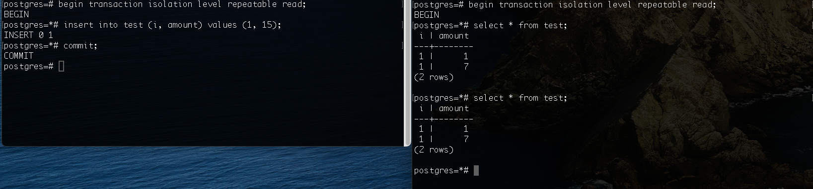

1-8) 

9) Вторая транзакция не видит изменений сделанных первой, потому что они не закомичены

10-11)
 

12) Теперь изменения закомичены и видны второй транзакции

13-12)
 

17) Новую запись не видим. Repeatable read имеет более высокий уровень изоляции чем read committed, следовательно проблема чтения не закомиченых данных на нём тоже не возникает

18-19)
 

20) Запись не видим, потому что при уровне изоляции repeatable read в транзакции будут видны данные закомиченные до начала этой транзакции
