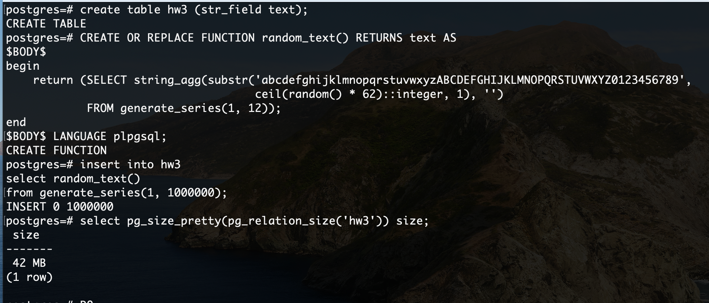
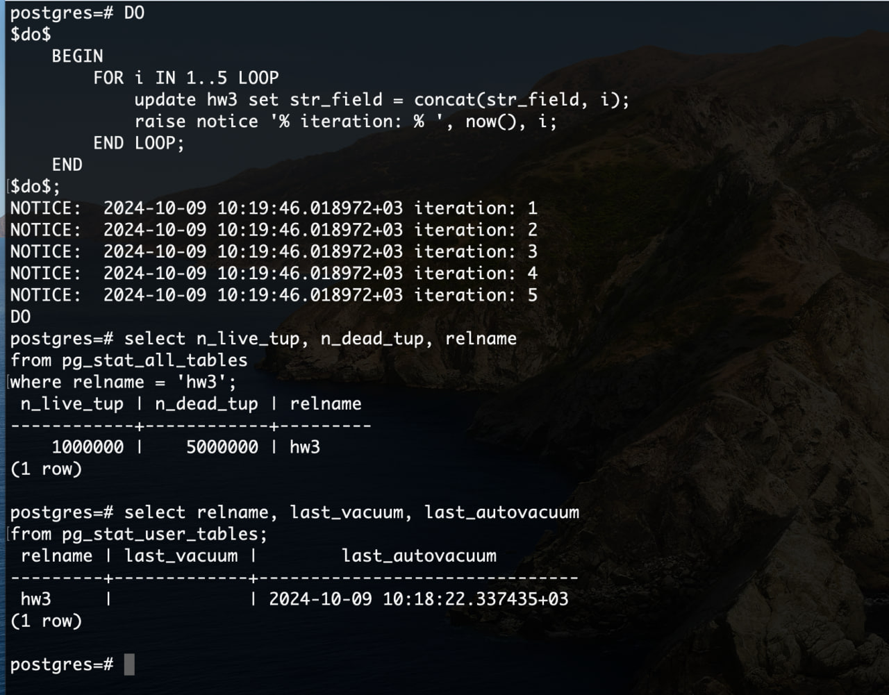
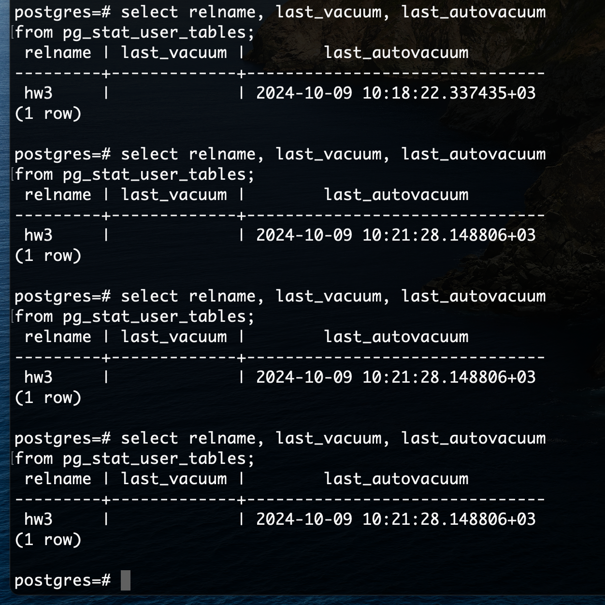
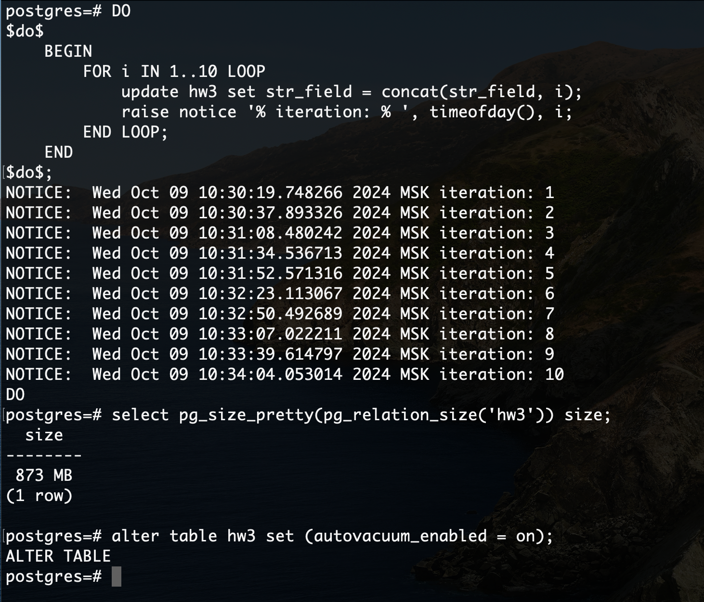

1. Создать таблицу с текстовым полем и заполнить случайными или сгенерированными данным в размере 1 млн строк
```create table hw3 (str_field text);```

```
CREATE OR REPLACE FUNCTION random_text() RETURNS text AS
$BODY$
begin
    return (SELECT string_agg(substr('abcdefghijklmnopqrstuvwxyzABCDEFGHIJKLMNOPQRSTUVWXYZ0123456789',
                                     ceil(random() * 62)::integer, 1), '')
            FROM generate_series(1, 12));
end
$BODY$ LANGUAGE plpgsql;
```

```
insert into hw3
select random_text()
from generate_series(1, 1000000);
```

2. Посмотреть размер файла с таблицей
```
select pg_size_pretty(pg_relation_size('hw3')) size;
```


3. 5 раз обновить все строчки и добавить к каждой строчке любой символ
```
DO
$do$
    BEGIN
        FOR i IN 1..5 LOOP
            update hw3 set str_field = concat(str_field, i);
            raise notice '% iteration: % ', statement_timestamp(), i;
        END LOOP;
    END
$do$;
```

4. Посмотреть количество мертвых строчек в таблице и когда последний раз приходил
автовакуум
```
select n_live_tup, n_dead_tup, relname
from pg_stat_all_tables
where relname = 'hw3';
```
```
select relname, last_vacuum, last_autovacuum
from pg_stat_user_tables;
```



5. Подождать некоторое время, проверяя, пришел ли автовакуум



6. 5 раз обновить все строчки и добавить к каждой строчке любой символ
```
DO
$do$
    BEGIN
        FOR i IN 1..5 LOOP
            update hw3 set str_field = concat(str_field, i);
            raise notice '% iteration: % ', statement_timestamp(), i;
        END LOOP;
    END
$do$;
```

7. Посмотреть размер файла с таблицей
```
select pg_size_pretty(pg_relation_size('hw3')) size;
```

8. Отключить Автовакуум на конкретной таблице
```
alter table hw3 set (autovacuum_enabled = off);
```

9. 10 раз обновить все строчки и добавить к каждой строчке любой символ
```
DO
$do$
    BEGIN
        FOR i IN 1..10 LOOP
            update hw3 set str_field = concat(str_field, i);
            raise notice '% iteration: % ', timeofday(), i;
        END LOOP;
    END
$do$;
```

10. Посмотреть размер файла с таблицей
```
select pg_size_pretty(pg_relation_size('hw3')) size;
```

11. Объясните полученный результат

autovacuum выключен и не помечает записи "мертвым", а ещё, autovacuum не возвращает занятое на диске место обратно OS, вместо этого дисковое пространство будет переиспользовано для новых записей. Чтобы освободить его для нужд OS можно запустить ```vacuum full;```

12. Не забудьте включить автовакуум)
```
alter table hw3 set (autovacuum_enabled = on);
```

