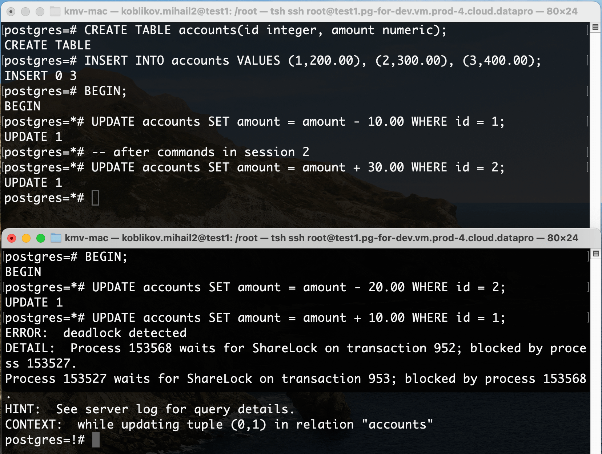

1. Создать таблицу accounts(id integer, amount numeric);
```sql
CREATE TABLE accounts(id integer, amount numeric);
```

2. Добавить несколько записей и подключившись через 2 терминала добиться ситуации взаимоблокировки (deadlock). 

```sql
INSERT INTO accounts VALUES (1,200.00), (2,300.00), (3,400.00);
```
```sql
-- в первом териминале
BEGIN;
UPDATE accounts SET amount = amount - 10.00 WHERE id = 1;
```
```sql
-- во втором териминале
BEGIN;
UPDATE accounts SET amount = amount - 20.00 WHERE id = 2;
```
```sql
-- в первом териминал
UPDATE accounts SET amount = amount + 30.00 WHERE id = 2;
```
```sql
-- во втором териминале
UPDATE accounts SET amount = amount + 10.00 WHERE id = 1;
```


3. Посмотреть логи и убедиться, что информация о дедлоке туда попала.


