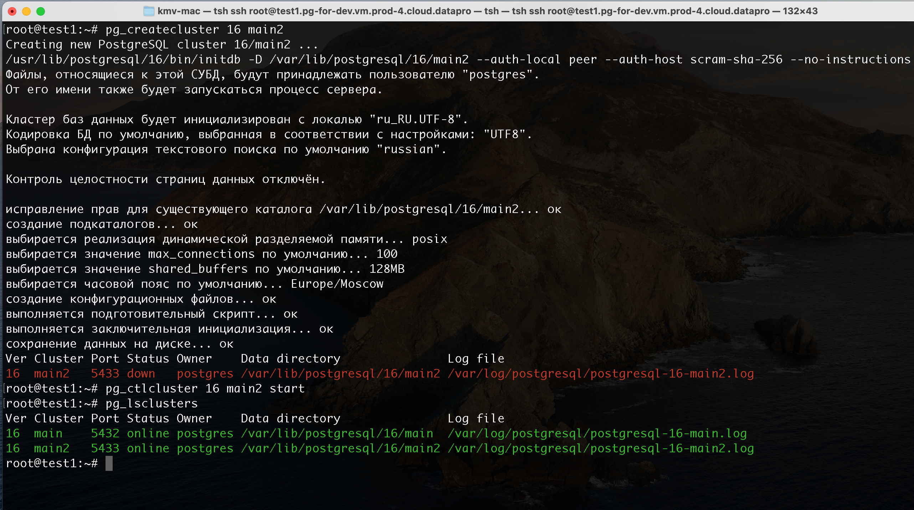
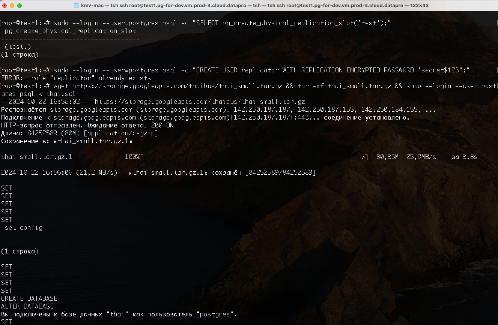
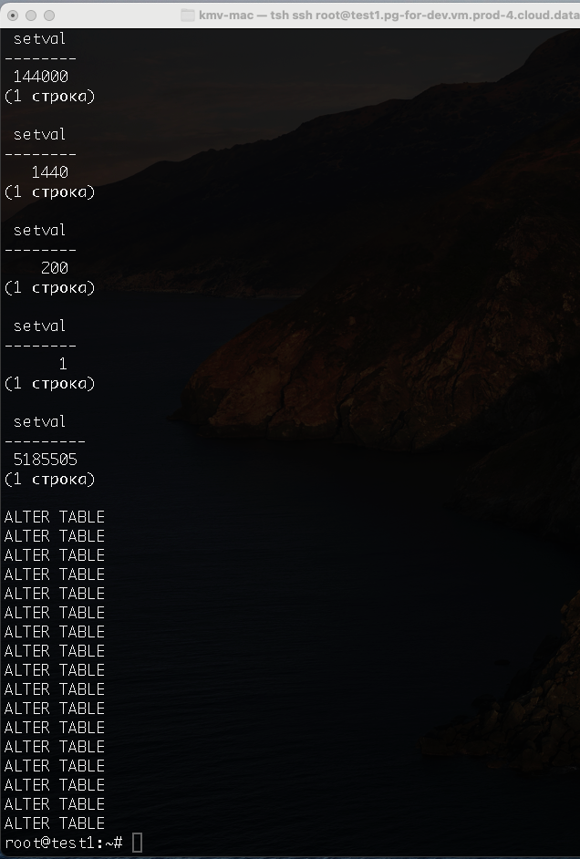
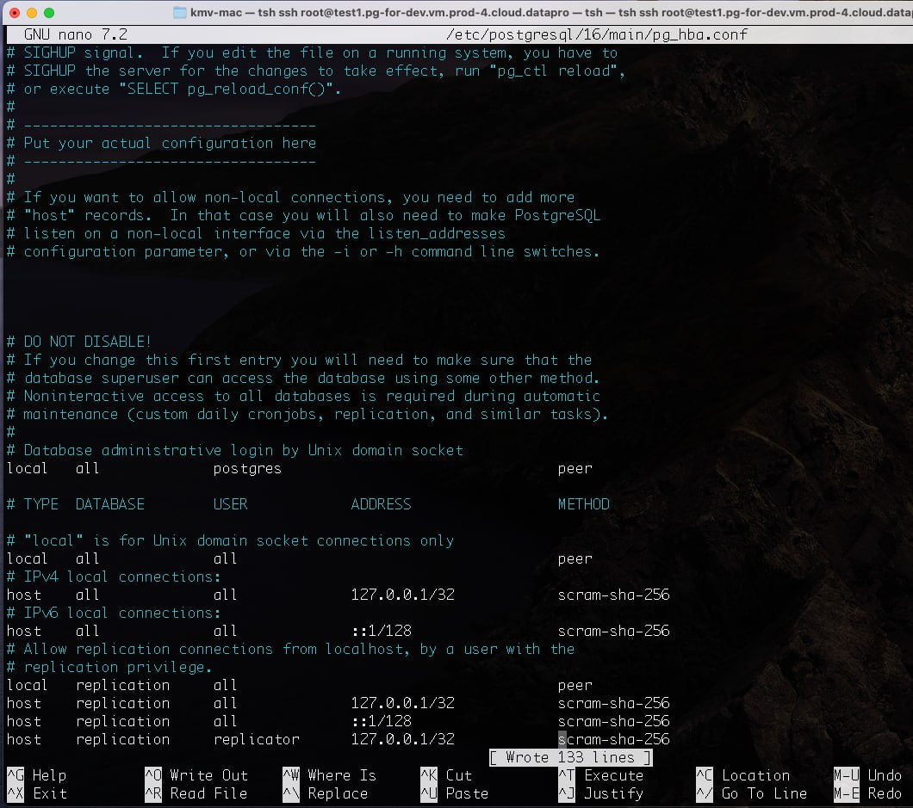
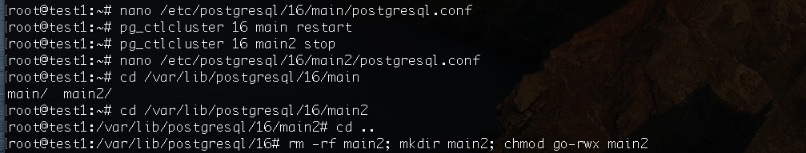
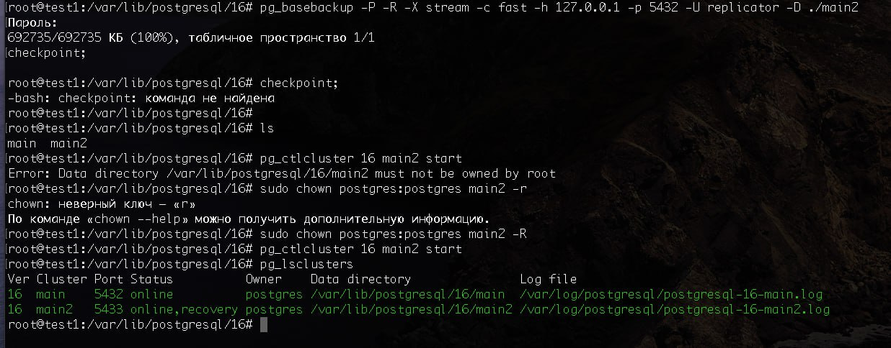
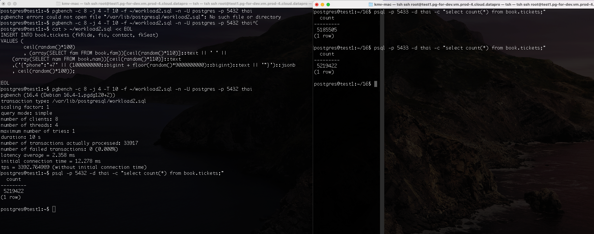
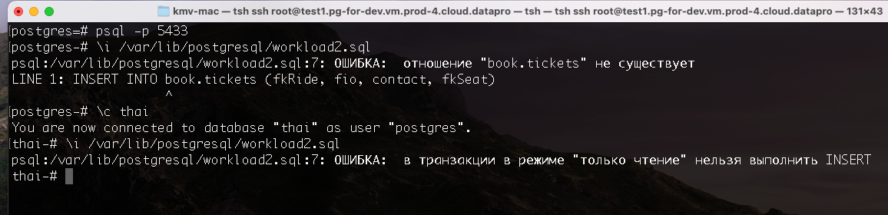
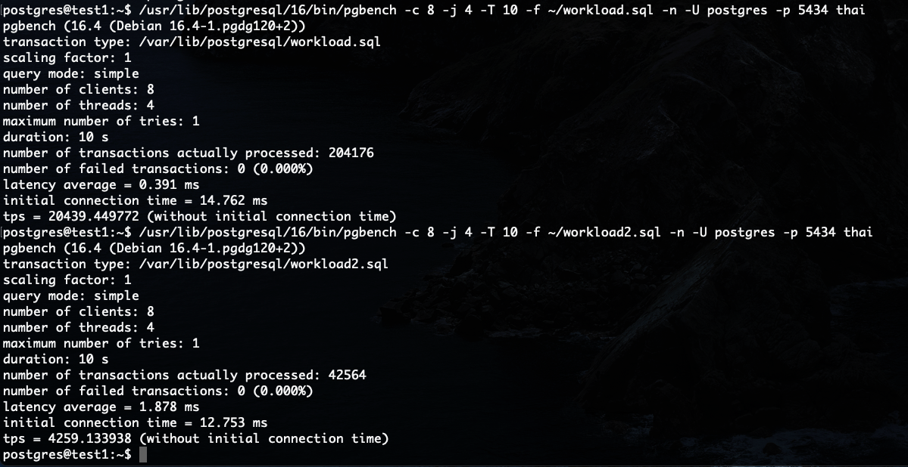

Создали новый "кластер" main2

Создали пользователя для репликации (на скриншоте с ошибкой, но потом она была исправлена). Создали слот. Залили в main дамп базы thai

Поправили правила доступа к кластеру main

В остановленном main2 удалили файлы и потом восстановили их из бекапа main и запустили main2

Даем нагрузку на запись, видим 3392tps, смотрим кол-во записей на мастере и реплике - кол-во совпадает

Убеждаемся, что не можем делать insert в реплику

Был поднят еще один "кластер" main3, в него залит тот же дамп БД thai, и дана такая же нагрузка, как видим 4259tps

