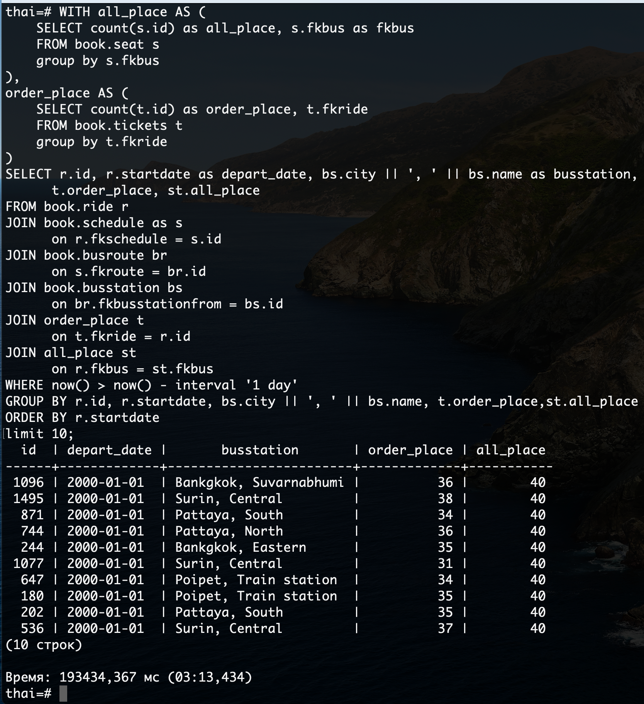
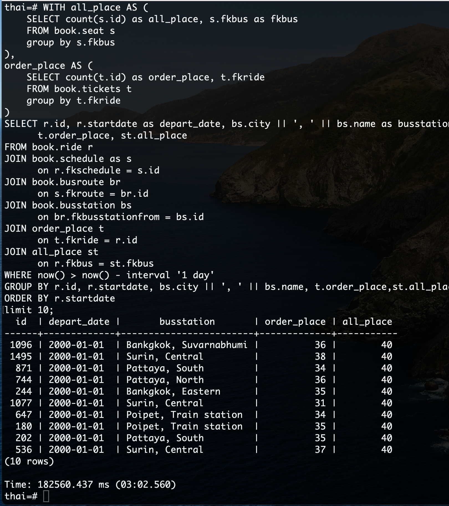
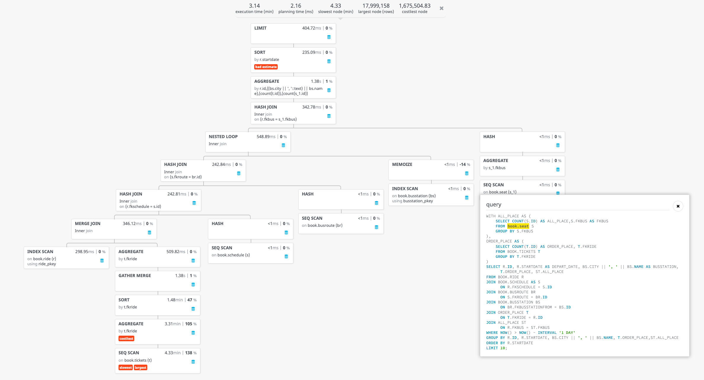

1) Запустили тяжелый запрос. Время выполнения 3мин 13сек 



2) Добавили индексы на внешнии ключи 

```sql
CREATE INDEX idx_ride_fkbus on book.ride(fkbus);
CREATE INDEX idx_ride_fkschedule on book.ride(fkschedule);
```

3) Вот так теперь выглядит схема таблицы book.ride


4) Запустили тяжелый запрос. Время выполнения 3мин 02сек. На скорость выполнения индексы сильно не повлияли, т.к. самая тяжелая часть запроса это СТЕ order_place, а добавление индекса не поможет, т. к. исходя из объемов данные мы ограничиваемся по work_mem и как следствие ограничены i/o машины, кроме того у нас в распоряжении 2cpu и как следствие воркеров больше 2 нет смысла запускать






