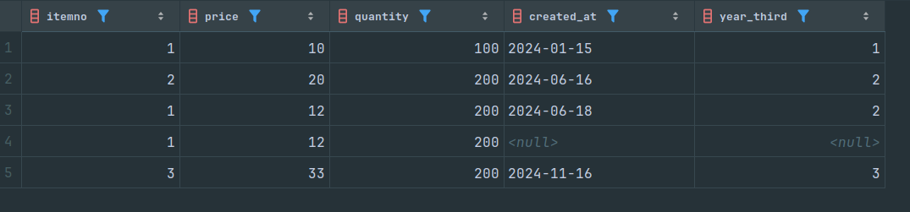

1) Создать таблицу с продажами

```sql
CREATE TABLE sales
(
    itemno     int,
    price      int,
    quantity   int,
    created_at date
);

INSERT INTO sales
VALUES (1, 10, 100, '2024-01-15'),
       (2, 20, 200, '2024-06-16'),
       (1, 12, 200, '2024-06-18'),
       (1, 12, 200, null),
       (3, 33, 200, '2024-11-16');
```
2) Реализовать фукнцию выбора трети года
   a) через case;
   c) предусмотреть null на входе;

```sql
CREATE FUNCTION third_v1(d date) RETURNS int AS
$$
SELECT CASE
           WHEN date_part('month', d) <= 4 THEN 1
           WHEN date_part('month', d) <= 8 THEN 2
           WHEN date_part('month', d) <= 12 THEN 3
           ELSE -1
           END;
$$ LANGUAGE SQL
    IMMUTABLE
    RETURNS NULL ON NULL INPUT;
```

3) Вызвать эту функцию в SELECT из таблицы с продажами, убедиться, что всё отработало

```sql
SELECT itemno, price, quantity, created_at, third_v1(created_at) AS year_third
FROM sales;
```


