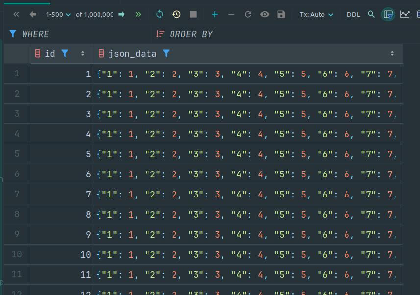
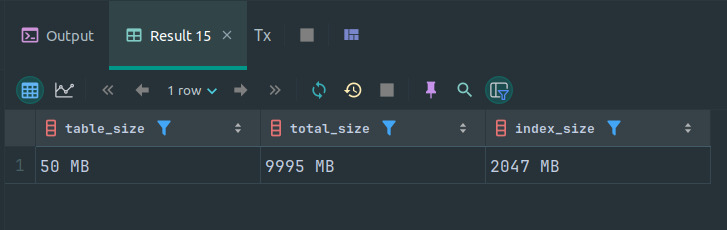
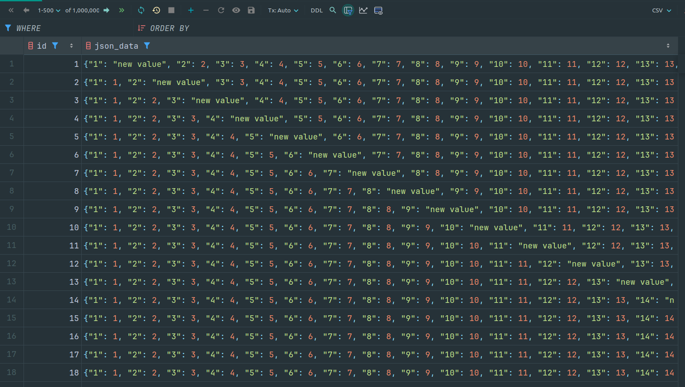
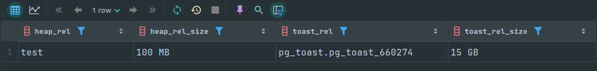
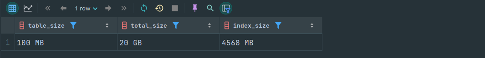

1. Сгенерировать таблицу с 1 млн JSONB документов

```sql
CREATE TABLE test AS
SELECT i AS id, (SELECT jsonb_object_agg(j, j) FROM generate_series(1, 1000) j) json_data
FROM generate_series(1, 1000000) i;
```



2. Создать индекс (он создавался 14m9s)

```sql
CREATE INDEX gin_test_json ON test USING gin (json_data);
```

И сразу смотрим размер таблицы с toast (это колонка total_size) и размер индекcов (index_size) с помощью расширения pg_trgm



3. Обновить 1 из полей в json (запрос выполнялся 32m54s)

```sql
UPDATE test SET json_data = jsonb_set(json_data, concat('{', mod(id, 1000), '}')::text[], '"new value"'::jsonb);
```



4. Убедиться в блоатинге TOAST

```sql
SELECT oid::regclass AS heap_rel,
       pg_size_pretty(pg_relation_size(oid)) AS heap_rel_size,
       reltoastrelid::regclass AS toast_rel,
       pg_size_pretty(pg_relation_size(reltoastrelid)) AS toast_rel_size
FROM pg_class WHERE relname = 'test';
```




6. Не забываем про блоатинг индексов* (Сделаем его перед исправлением bloating'a toast)

скриншот сделан до решения проблема toast bloating


```sql
CREATE EXTENSION pg_trgm;
       
SELECT pg_size_pretty(pg_relation_size('test'))       AS table_size,
       pg_size_pretty(pg_total_relation_size('test')) AS total_size,
       pg_size_pretty(pg_relation_size('gin_test_json'))   AS index_size;
```

Реиндексировали индекс (14m12s)

```sql
REINDEX INDEX gin_test_json;
```

Смотрим сколько места теперь он занимает, сократили объем на 2.5гб


5. Придумать методы избавится от него и проверить на практике

Первый метод это выполнить
```sql
VACUUM FULL;
```

Второй создать копию таблицы и перелить в неё данные (по хорошему надо не забывать создать триггеры на создание и обновление записей, чтобы не потерять данные обновленные в результате переноса, но этот момент пропустим)
```sql
CREATE TABLE new_test (LIKE test INCLUDING ALL);
COPY test TO '/var/lib/postgresql/data/test.sql';
COPY new_test FROM '/var/lib/postgresql/data/test.sql';
ALTER TABLE test RENAME TO old_test;
ALTER TABLE new_test RENAME TO test;
DROP TABLE old_test;
ALTER INDEX new_test_json_data_idx RENAME TO gin_test_json;
```

Смотрим сколько места теперь он занимает, сократили объем на 8гб. Теперь таблица занимает примерно столько же места, сколько и занимала на шаге 2


