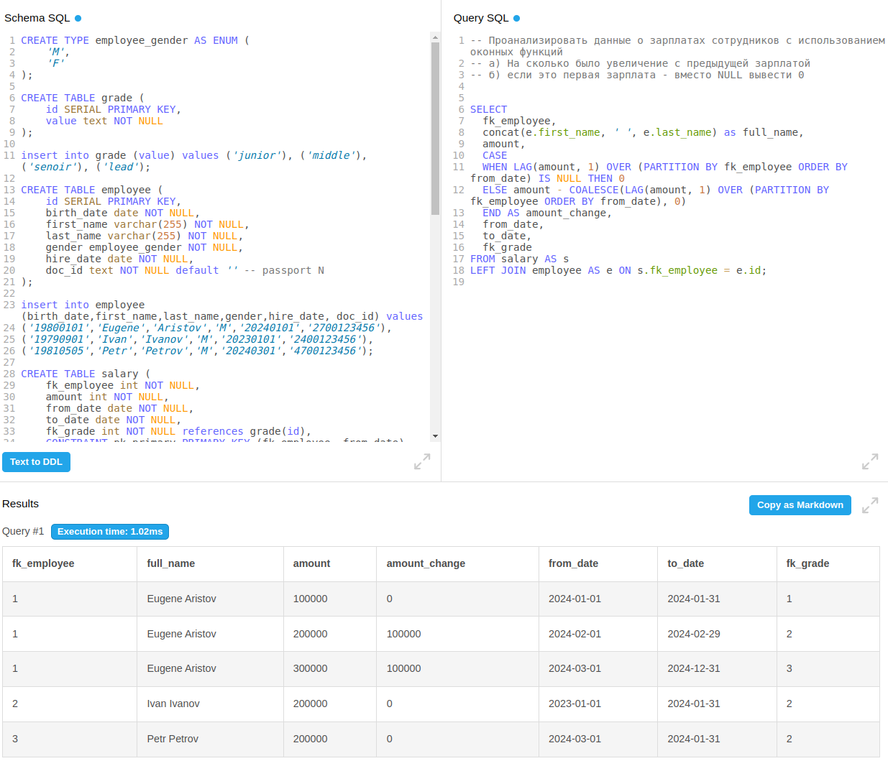

1) Проанализировать данные о зарплатах сотрудников с использованием оконных функций
   а) На сколько было увеличение с предыдущей зарплатой
   б) если это первая зарплата - вместо NULL вывести 0

```sql
SELECT
  fk_employee, 
  concat(e.first_name, ' ', e.last_name) as full_name,
  amount, 
  CASE 
  WHEN LAG(amount, 1) OVER (PARTITION BY fk_employee ORDER BY from_date) IS NULL THEN 0 
  ELSE amount - COALESCE(LAG(amount, 1) OVER (PARTITION BY fk_employee ORDER BY from_date), 0) 
  END AS amount_change,
  from_date, 
  to_date, 
  fk_grade
FROM salary AS s
LEFT JOIN employee AS e ON s.fk_employee = e.id;
```


